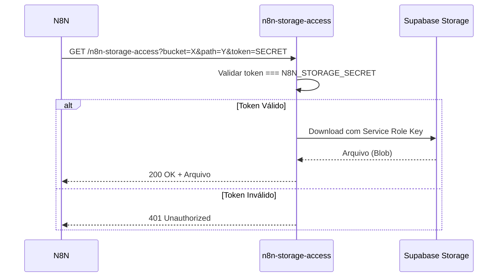

# 🔐 Configuração do N8N Storage Access - Lush America Translations

## 📋 Resumo
Este documento descreve a configuração necessária para que o N8N possa acessar arquivos privados no Supabase Storage via Edge Function autenticada.

---

## 🎯 Senha Gerada (N8N Storage Secret)

```
tfoe_n8n_lush_2026_KpQ7mXz3Rv9wBfN2HjL4sY6tVcD8xU1eAoI5gP0nM
```

**⚠️ IMPORTANTE**: Esta senha deve ser mantida em segredo. Ela garante que apenas o N8N autorizado possa baixar arquivos dos buckets privados.

---

## ⚙️ Configuração Manual no Supabase Dashboard

Como a CLI não possui permissões suficientes para configurar Secrets automaticamente, siga os passos abaixo:

### 1. Acesse o Dashboard do Supabase
- URL: https://supabase.com/dashboard/project/yslbjhnqfkjdoxuixfyh

### 2. Navegue até Edge Functions Secrets
- Menu lateral: **Project Settings** (engrenagem no canto inferior esquerdo)
- Submenu: **Edge Functions**
- Aba: **Secrets**

### 3. Adicione a Secret
- Clique em **Add new secret**
- Nome da Secret: `N8N_STORAGE_SECRET`
- Valor: `tfoe_n8n_lush_2026_KpQ7mXz3Rv9wBfN2HjL4sY6tVcD8xU1eAoI5gP0nM`
- Clique em **Save**

### 4. Verifique as Edge Functions
- Navegue até **Edge Functions** no menu lateral
- Verifique se as seguintes funções estão com `verify_jwt: false`:
  - ✅ `n8n-storage-access` (já configurada)
  - ✅ `send-translation-webhook` (já configurada)
  - ✅ `serve-document` (já configurada)

---

## 🏗️ Arquitetura de Segurança

### Edge Functions com JWT Desativado
As seguintes funções **NÃO** requerem JWT do Supabase:

| Função                      | JWT Ativo? | Tipo de Segurança                     |
|-----------------------------|------------|---------------------------------------|
| `n8n-storage-access`        | ❌ Não     | Token Secreto (N8N_STORAGE_SECRET)    |
| `send-translation-webhook`  | ❌ Não     | Chamada interna/frontend              |
| `serve-document`            | ❌ Não     | Proxy público (com rate limiting)     |

### Por que JWT está Desativado?
O N8N é um serviço externo que não possui "usuário logado" no Supabase. Se o JWT estivesse ativo, todas as chamadas do N8N seriam bloqueadas automaticamente pelo gateway.

### Segurança Personalizada (Custom Auth)
Em vez de JWT, implementamos:
1. **Token na URL**: O N8N envia `?token=tfoe_n8n_lush_2026_...` em cada requisição
2. **Validação Interna**: A Edge Function compara o token enviado com `N8N_STORAGE_SECRET`
3. **Service Role Key**: Só após validação, a função usa a chave mestra para baixar o arquivo

---

## 🔄 Fluxo de Acesso do N8N



---

## 📁 Arquivos Configurados

### `.env` Local (Já Atualizado ✅)
```env
# N8N STORAGE ACCESS TOKEN (Secret para acesso aos buckets privados)
VITE_N8N_STORAGE_TOKEN=tfoe_n8n_lush_2026_KpQ7mXz3Rv9wBfN2HjL4sY6tVcD8xU1eAoI5gP0nM
N8N_STORAGE_SECRET=tfoe_n8n_lush_2026_KpQ7mXz3Rv9wBfN2HjL4sY6tVcD8xU1eAoI5gP0nM
```

### Edge Functions (Já Implementadas ✅)
- `supabase/functions/n8n-storage-access/index.ts` - Proxy autenticado para N8N
- `supabase/functions/send-translation-webhook/index.ts` - Webhook que envia URLs seguras
- `src/lib/storage.ts` - Utilitários de frontend para gerar URLs

---

## 🧪 Como Testar

### 1. Testar a Edge Function Diretamente
```bash
# URL de Teste (substitua [BUCKET], [PATH] e [TOKEN])
curl "https://yslbjhnqfkjdoxuixfyh.supabase.co/functions/v1/n8n-storage-access?bucket=documents&path=test.pdf&token=tfoe_n8n_lush_2026_KpQ7mXz3Rv9wBfN2HjL4sY6tVcD8xU1eAoI5gP0nM"
```

**Respostas Esperadas:**
- ✅ `200 OK` + PDF baixado → Configuração correta
- ❌ `401 Unauthorized` → Secret não configurada ou token incorreto
- ❌ `404 Not Found` → Arquivo não existe no bucket

### 2. Verificar Logs
- Dashboard do Supabase → **Edge Functions** → `n8n-storage-access` → **Logs**

---

## 🔧 Manutenção Futura

### Rotação de Secret
Se a senha vazar ou precisar ser trocada:
1. Gere uma nova senha forte (use geradores como 1Password, Bitwarden)
2. Atualize no Dashboard: **Settings → Edge Functions → Secrets → N8N_STORAGE_SECRET**
3. Atualize no `.env` local: `VITE_N8N_STORAGE_TOKEN` e `N8N_STORAGE_SECRET`
4. Atualize no N8N: Configure a nova senha nas requisições

**Downtime**: Zero! As URLs antigas param de funcionar imediatamente após trocar a Secret.

### Escalabilidade
Para projetos maiores, considere:
- **API Keys Rotativas**: Armazenar múltiplas API Keys em uma tabela `n8n_api_keys`
- **Rate Limiting**: Implementar limites por token
- **Audit Logs**: Registrar todas as requisições autenticadas

---

## 📊 Status Atual

| Item                              | Status |
|-----------------------------------|--------|
| Senha gerada                      | ✅      |
| `.env` local atualizado           | ✅      |
| Edge Function `n8n-storage-access`| ✅      |
| Edge Function `send-translation-webhook` atualizada | ✅ |
| Utilitários frontend (`storage.ts`) | ✅   |
| **Secret configurada no Supabase** | ⏳ **PENDENTE (Manual)** |

---

## 🚨 Ação Necessária

**Você precisa configurar a Secret manualmente no Dashboard do Supabase seguindo as instruções na seção "Configuração Manual" acima.**

Após configurar, teste a URL de exemplo para garantir que está funcionando.

---

## 📞 Suporte

Se encontrar problemas:
1. Verifique os logs da Edge Function no Dashboard
2. Confirme que a Secret está salva corretamente
3. Teste com `curl` antes de testar com N8N
4. Verifique se o bucket e path estão corretos

---

**Gerado em**: 2026-02-03  
**Projeto**: Lush America Translations  
**Responsável**: Sistema de Armazenamento Seguro
