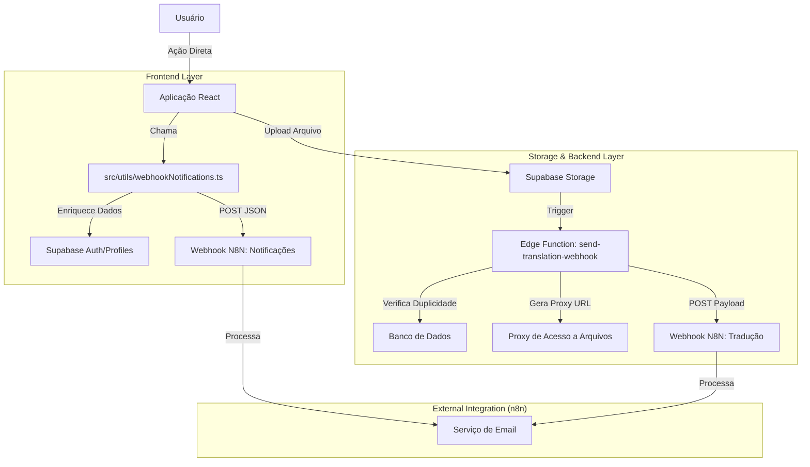

# Documentação Técnica: Sistema de Notificações e Webhooks

**Data de Criação:** 11/02/2026
**Projeto:** Lush America Translation
**Responsável:** Equipe de Engenharia

---

## 1. Visão Geral

O sistema de notificações do Lush America Translation opera sob uma arquitetura orientada a eventos (Event-Driven). Ao invés de realizar o envio de e-mails diretamente através de serviços SMTP acoplados ao código da aplicação, o sistema dispara **Webhooks** para endpoints externos hospedados no **n8n**. 

O **n8n** atua como o orquestrador de comunicações, recebendo os dados brutos, processando a lógica de negócios (templates, destinatários) e realizando o envio final via provedores de e-mail.

Existem dois vetores principais de disparo de notificações:
1.  **Disparo via Cliente (Frontend):** Notificações síncronas de interação do usuário (ex: confirmação de pagamento, início de tradução).
2.  **Disparo via Servidor (Edge Function):** Processamento assíncrono de arquivos pesados, uploads no Storage e garantia de integridade de dados.

---

## 2. Arquitetura da Solução

### Diagrama de Fluxo de Dados



### Endpoints Externos (Recebedores)

O sistema aponta para dois fluxos de trabalho distintos no n8n:

1.  **Notificações Gerais (Interação Usuário -> Sistema):**
    *   **URL:** `https://nwh.thefutureofenglish.com/webhook/notthelush1`
    *   **Responsabilidade:** E-mails de boas-vindas, confirmação de recebimento de pagamento, alertas para autenticadores.

2.  **Processamento de Tradução (Sistema -> Backoffice):**
    *   **URL:** `https://nwh.thefutureofenglish.com/webhook/thelushamericatranslations`
    *   **Responsabilidade:** Recebimento de arquivos de tradução, processamento de anexos, inserção na fila de trabalho.

---

## 3. Detalhamento dos Componentes

### 3.1. Cliente Frontend (`src/utils/webhookNotifications.ts`)

Este utilitário centraliza a lógica de notificações disparadas pela interface. Ele abstrai a complexidade de buscar dados do usuário e garante que o payload enviado ao n8n esteja sempre completo.

**Funcionalidades Chave:**
*   **Enriquecimento de Dados (`getUserInfo`):** Antes de enviar qualquer notificação, o sistema busca automaticamente o `name` e `email` do usuário na tabela `profiles` ou via API de Admin do Auth, garantindo que o n8n nunca receba IDs crus sem contexto.
*   **Tipos de Notificação Padronizados:**
    *   `UPLOAD`: Novo documento enviado pelo cliente.
    *   `PAYMENT`: Confirmação de pagamento processado.
    *   `TRANSLATION_STARTED`: Tradução iniciada pelo tradutor.
    *   `TRANSLATION_COMPLETED`: Tradução finalizada e entregue.
    *   `AUTHENTICATOR_PENDING_DOCUMENTS`: Loop de notificação em massa para todos os usuários com role `authenticator`.

**Exemplo de Payload (JSON):**
```json
{
  "user_name": "Paulo Silva",
  "user_email": "paulo@exemplo.com",
  "notification_type": "Payment Notification",
  "timestamp": "2024-02-11T14:30:00Z",
  "payment_info": {
    "amount": 150.00,
    "currency": "BRL",
    "payment_id": "pi_3M..."
  }
}
```

### 3.2. Edge Function (`supabase/functions/send-translation-webhook`)

Esta função server-side é crítica para a integridade do fluxo de arquivos. Ela atua como um middleware inteligente entre o Storage do Supabase e o n8n.

**Lógica Crítica Implementada:**

1.  **Prevenção de Duplicidade (De-bouncing):**
    *   Problema: Uploads podem falhar e tentar novamente, ou triggers podem disparar múltiplas vezes.
    *   Solução: Verifica na tabela `documents_to_be_verified` se um arquivo com mesmo `filename` e `user_id` foi processado nos últimos 2 minutos. Se sim, rejeita a execução para evitar e-mails duplicados.
    
2.  **Proxy de Acesso a Arquivos (Segurança):**
    *   Problema: Os buckets do Supabase são privados (`private`). O n8n externo não consegue baixar os arquivos diretamente via URL simples.
    *   Solução: A função gera ou converte URLs para usar um endpoint de Proxy Autenticado (`/functions/v1/n8n-storage-access`). O token de acesso é embutido na URL, permitindo que o n8n baixe o arquivo de forma segura sem expor o bucket publicamente.

3.  **Normalização de Schema:**
    *   A função aceita payloads vindos tanto de Triggers de Banco de Dados (`record`) quanto de chamadas diretas via API (`https`), normalizando campos como `idioma_raiz` vs `source_language` para um formato único antes do envio.

---

## 4. Guia de Replicação

Para implementar esta funcionalidade em um novo sistema, siga este roteiro técnico:

### Passo 1: Configurar a Infraestrutura de Automação (n8n)
1.  Instancie um workflow no n8n.
2.  Adicione um nó **Webhook** (Método POST).
3.  Adicione nós de lógica para processar o JSON recebido.
4.  Conecte a um serviço de envio de e-mail (SMTP/SendGrid/AWS SES).

### Passo 2: Implementar o Cliente (Aplicação)
Copie o padrão de `src/utils/webhookNotifications.ts`.
**Requisitos:**
*   Acesso de leitura à tabela de perfis de usuário (`profiles` ou similar).
*   Definição clara das constantes de tipos de notificação.

### Passo 3: Implementar a Edge Function (Backend)
Se o seu sistema envolve processamento de arquivos:
1.  Crie uma Edge Function no Supabase (`deno`).
2.  Configure as variáveis de ambiente: `SUPABASE_URL`, `SUPABASE_SERVICE_ROLE_KEY`, `N8N_STORAGE_SECRET`.
3.  Implemente a lógica de conversão de URLs privadas para URLs acessíveis (Signed URLs ou Proxy).
4.  Implemente a verificação de duplicidade (`idempotency`) usando uma tabela de log ou cache (Redis/Banco).

### Passo 4: Segurança (RLS e Policies)
*   **Edge Functions:** Devem rodar com a chave `SERVICE_ROLE` para ignorar RLS quando necessário (ex: verificar duplicatas globais).
*   **Frontend:** Deve usar a chave `ANON` e respeitar as políticas de segurança (RLS) do banco de dados.

---

## 5. Referências de Código

Para detalhes específicos de implementação, consulte os seguintes arquivos no repositório:

*   **Frontend Trigger:** `src/utils/webhookNotifications.ts`
*   **Backend Logic:** `supabase/functions/send-translation-webhook/index.ts`
*   **Proxy de Arquivos:** `supabase/functions/n8n-storage-access/index.ts`
